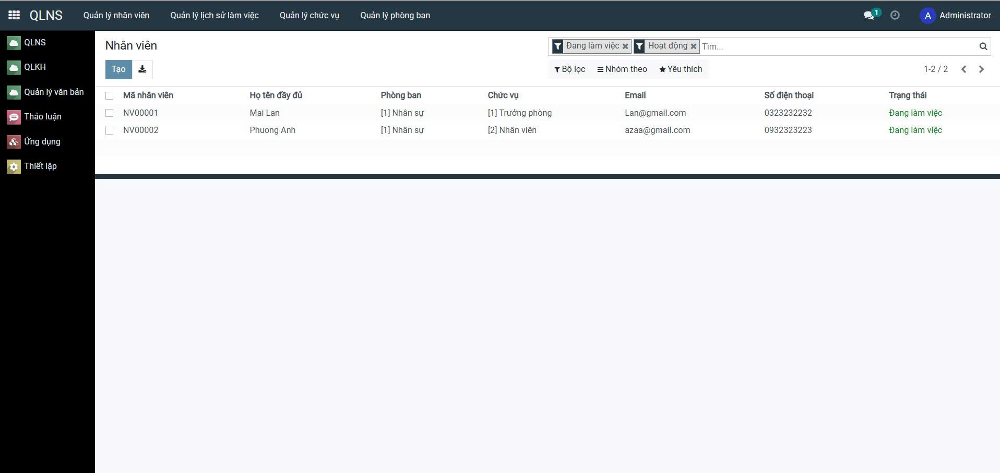
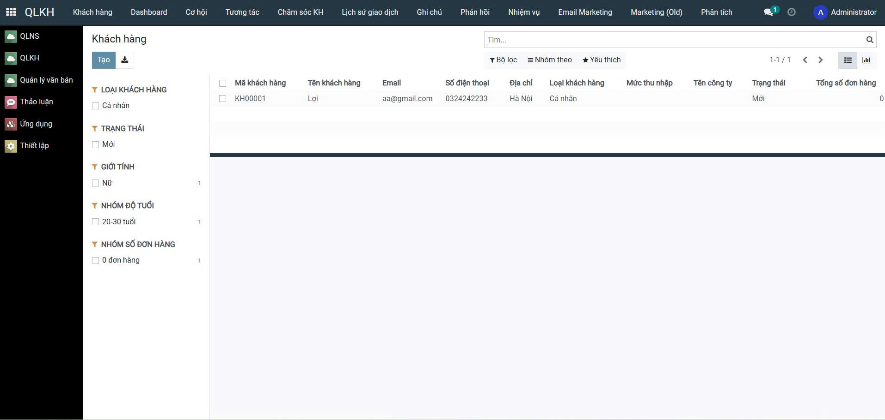
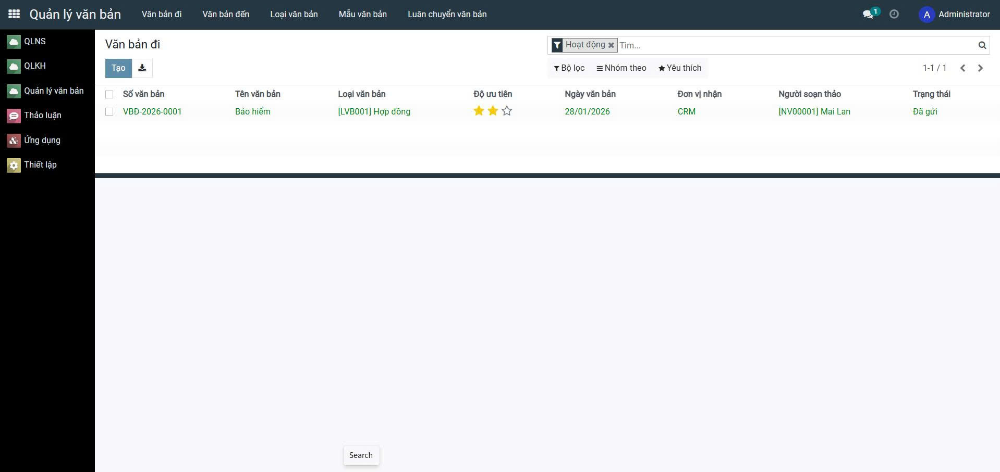
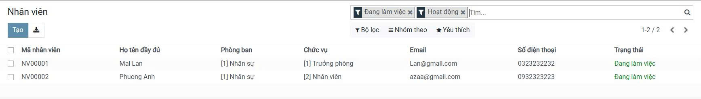
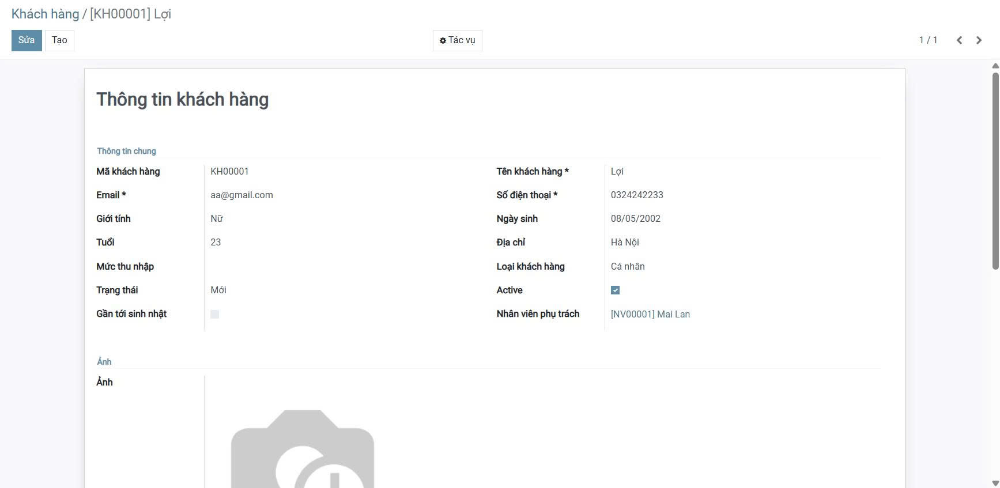
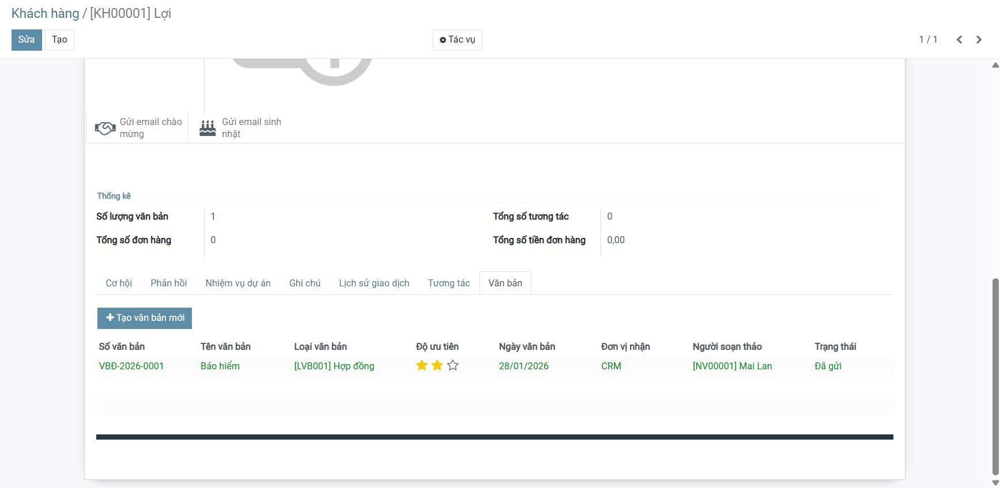
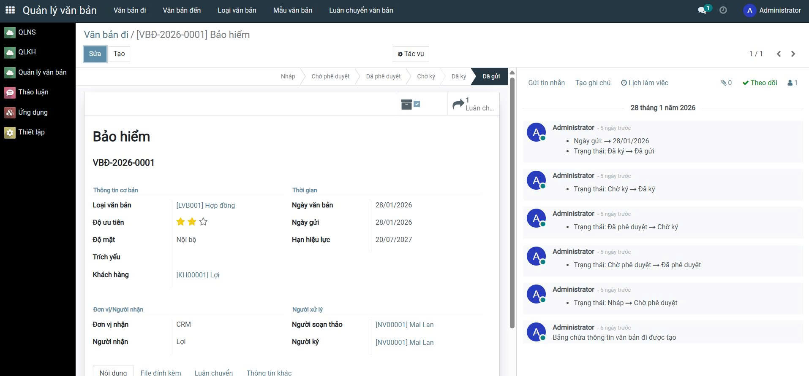

<h2 align="center">
    <a href="https://dainam.edu.vn/vi/khoa-cong-nghe-thong-tin">
    🎓 Faculty of Information Technology (DaiNam University)
    </a>
</h2>
<h2 align="center">
    Hệ Thống Quản Lý Nhân Sự, Khách Hàng & Văn Bản<br/>
    <small>HRM, CRM & Document Management System</small>
</h2>
<div align="center">
    <p align="center">
        
        
        
    </p>

[](https://www.facebook.com/DNUAIoTLab)
[](https://dainam.edu.vn/vi/khoa-cong-nghe-thong-tin)
[](https://dainam.edu.vn)

</div>
 

## 📖 1. Giới thiệu

Hệ thống **Quản lý Nhân Sự, Khách Hàng & Văn Bản** được xây dựng trên nền tảng **Odoo 17**, giúp doanh nghiệp số hóa toàn diện quy trình quản trị nhân sự: quản lý nhân viên, lịch sử làm việc, chức vụ, phòng ban; đồng thời chăm sóc khách hàng và lưu trữ, xử lý văn bản nội bộ.

### Thông tin kỹ thuật

#### 1. Quản lý Nhân Sự (HRM)
**Quản lý nhân viên, lịch sử làm việc, chức vụ, phòng ban:**
    - Model: `Employee` ([addons/hr_presence/models/hr_employee.py](addons/hr_presence/models/hr_employee.py))
    - Quản lý thông tin nhân viên, lịch sử làm việc, chức vụ, phòng ban

#### 2. Quản lý Khách Hàng (CRM)
- **Chức năng chính:**
    - Quản lý thông tin khách hàng
    - Dashboard tổng quan
    - Quản lý cơ hội (opportunity)
    - Quản lý tương tác, chăm sóc khách hàng
    - Theo dõi lịch sử giao dịch, ghi chú, phản hồi
    - Quản lý nhiệm vụ liên quan đến khách hàng
    - Email Marketing, Marketing (Old)
    - Phân tích dữ liệu, báo cáo
    - Model: `Partner` ([addons/crm/models/res_partner.py](addons/crm/models/res_partner.py))
    - Model: `crm.lead` ([addons/crm/models/crm_lead.py](addons/crm/models/crm_lead.py))

#### 3. Quản lý Văn Bản (Document)
- **Chức năng chính:**
    - Quản lý văn bản đi
    - Quản lý văn bản đến
    - Quản lý loại văn bản
    - Quản lý mẫu văn bản
    - Quản lý, theo dõi luân chuyển văn bản


<div align="center">

📸 **Giao diện hệ thống**

<p>
    
    
    
</p>

</div>

<br/>

### 🎯 Lợi ích chính:
- ✅ Số hóa toàn bộ quy trình nhân sự, khách hàng, văn bản
- ✅ Loại bỏ giấy tờ, Excel rời rạc, tăng hiệu quả quản trị
- ✅ Quản lý tập trung, phân quyền rõ ràng
- ✅ Báo cáo trực quan, tìm kiếm nhanh
- ✅ Dễ dàng mở rộng, tích hợp các module khác

### 📌 3 Module Cốt Lõi:
1. **Quản lý Nhân Sự (HRM)** - Quản lý nhân viên, lịch sử làm việc, chức vụ, phòng ban
2. **Quản lý Khách Hàng (CRM)** - Thông tin khách hàng, lịch sử giao dịch, chăm sóc khách hàng
3. **Quản lý Văn Bản (Document)** - Văn bản đi, văn bản đến, loại văn bản, mẫu văn bản, luân chuyển văn bản

## 🎨 2. Các Tính Năng Chi Tiết

### 1️⃣ Quản lý Nhân Sự (HRM Module) 👥
**Quản lý toàn bộ thông tin nhân viên, lịch sử làm việc, chức vụ, phòng ban**

<div align="center">
    
</div>

| Tính năng | Mô tả |
|-----------|-------|
| 📋 Quản lý nhân viên | Thông tin cá nhân, liên lạc, giấy tờ |
| 🕓 Lịch sử làm việc | Theo dõi quá trình công tác, thay đổi vị trí |
| 🏷️ Quản lý chức vụ | Tạo, chỉnh sửa, phân loại chức vụ |
| 🏢 Quản lý phòng ban | Tạo, chỉnh sửa phòng ban, cấu trúc tổ chức |
| 🔒 Phân quyền | Phân quyền theo phòng ban, chức vụ |

### 2️⃣ Quản lý Khách Hàng (CRM Module) 🤝
**Quản lý khách hàng, cơ hội, tương tác, chăm sóc, lịch sử giao dịch, nhiệm vụ, marketing, phân tích**

<div align="center">
    
    
</div>

| Tính năng | Mô tả |
|-----------|-------|
| 👤 Quản lý khách hàng | Lưu trữ, cập nhật thông tin khách hàng |
| 📊 Dashboard | Tổng quan dữ liệu, chỉ số khách hàng |
| 💼 Cơ hội | Quản lý cơ hội bán hàng, tiềm năng |
| 🤝 Tương tác | Ghi nhận, quản lý các hoạt động tương tác với khách hàng |
| 💬 Chăm sóc KH | Quản lý lịch sử chăm sóc, nhắc nhở tự động |
| 🕓 Lịch sử giao dịch | Theo dõi các giao dịch, hợp đồng, đơn hàng |
| 📝 Ghi chú | Lưu trữ ghi chú liên quan đến khách hàng |
| 📨 Phản hồi | Quản lý phản hồi, ý kiến khách hàng |
| ✅ Nhiệm vụ | Quản lý nhiệm vụ liên quan đến khách hàng |
| 📧 Email Marketing | Gửi email marketing, quản lý chiến dịch |
| 📢 Marketing (Old) | Quản lý các chiến dịch marketing cũ |
| 📈 Phân tích | Phân tích dữ liệu, báo cáo khách hàng |

### 3️⃣ Quản lý Văn Bản (Document Module) 📄
**Quản lý văn bản đi, văn bản đến, loại văn bản, mẫu văn bản, luân chuyển văn bản**

<div align="center">
    
</div>

| Tính năng | Mô tả |
|-----------|-------|
| 📤 Văn bản đi | Quản lý, lưu trữ, theo dõi văn bản đi |
| 📥 Văn bản đến | Quản lý, lưu trữ, theo dõi văn bản đến |
| 🗂️ Loại văn bản | Phân loại, quản lý các loại văn bản |
| 📄 Mẫu văn bản | Quản lý, sử dụng các mẫu văn bản chuẩn |
| 🔄 Luân chuyển văn bản | Theo dõi, quản lý quá trình luân chuyển văn bản |

## 🛠️ 3. Công Nghệ & Công Cụ

<div align="center">

### Backend & Database
[](https://www.python.org/)
[](https://www.odoo.com/)
[](https://www.postgresql.org/)

### Frontend
[](#)
[](#)
[](#)

### DevOps & Deployment
[](https://www.docker.com/)
[](https://docs.docker.com/compose/)
[](https://git-scm.com/)

### Operating Systems


</div>

## ⚙️ 4. Cài Đặt & Chạy Hệ Thống

### 📋 4.1 Yêu Cầu Hệ Thống
- **Python 3.10+**
- **PostgreSQL 12+**
- **Docker & Docker Compose** (khuyến nghị)
- **Git**
- **RAM: 4GB+**, **Disk: 10GB+**

### 🐳 4.2 Cài Đặt Nhanh với Docker (Khuyến nghị)

```bash
# 1. Clone project
git clone https://github.com/your-repo/odoo-fitdnu.git
cd odoo-fitdnu

# 2. Khởi động
docker-compose up -d

# 3. Truy cập tại http://localhost:8070
# Username: admin
# Password: admin
```

### 🖥️ 4.3 Cài Đặt Trên Linux (Ubuntu/Debian)

```bash
# 1. Cập nhật hệ thống
sudo apt update && sudo apt upgrade -y

# 2. Cài đặt dependencies
sudo apt install -y python3 python3-pip python3-dev postgresql postgresql-contrib \
    git libxml2-dev libxslt1-dev libzip-dev libsasl2-dev libssl-dev libffi-dev

# 3. Clone project
cd /opt
sudo git clone https://github.com/your-repo/odoo-fitdnu.git
cd odoo-fitdnu

# 4. Virtual environment
python3 -m venv venv
source venv/bin/activate

# 5. Install Python packages
pip install -r requirements.txt

# 6. Cấu hình Database PostgreSQL
sudo -u postgres createdb odoo_db
sudo -u postgres createuser -P odoo_user

# 7. Cấu hình Odoo
cp odoo.conf.template odoo.conf
# Sửa file odoo.conf: db_name, db_user, db_password

# 8. Chạy Odoo
./odoo-bin -c odoo.conf
# Hoặc: python3 odoo-bin.py -c odoo.conf

# 9. Truy cập: http://localhost:8070
```

### 🪟 4.4 Cài Đặt Trên Windows

```bash
# 1. Tải Python 3.10+ từ https://www.python.org/downloads/
# 2. Tải PostgreSQL từ https://www.postgresql.org/download/windows/

# 3. Clone project
git clone https://github.com/your-repo/odoo-fitdnu.git
cd odoo-fitdnu

# 4. Virtual environment
python -m venv venv
venv\Scripts\activate

# 5. Install dependencies
pip install -r requirements.txt

# 6. Chạy Odoo
python odoo-bin.py -c odoo.conf

# 7. Truy cập: http://localhost:8070
```

## 📚 5. Hướng Dẫn Sử Dụng

### 5.1 Module Quản Lý Nhân Sự (HRM)
```
Menu: Nhân sự → Quản lý nhân viên, lịch sử làm việc, chức vụ, phòng ban
Chức năng:
- Quản lý thông tin nhân viên
- Quản lý lịch sử làm việc, chức vụ
- Quản lý phòng ban
- Phân quyền theo phòng ban, chức vụ
```

### 5.2 Module Quản Lý Khách Hàng (CRM)
```
Menu: QLKH → Khách hàng, Dashboard, Cơ hội, Tương tác, Chăm sóc KH, Lịch sử giao dịch, Ghi chú, Phản hồi, Nhiệm vụ, Email Marketing, Marketing (Old), Phân tích
Chức năng:
- Quản lý thông tin khách hàng
- Dashboard tổng quan
- Quản lý cơ hội, tương tác, chăm sóc khách hàng
- Theo dõi lịch sử giao dịch, ghi chú, phản hồi
- Quản lý nhiệm vụ, email marketing, phân tích dữ liệu
```

### 5.3 Module Quản Lý Văn Bản (Document)
```
Menu: Quản lý văn bản → Văn bản đi, Văn bản đến, Loại văn bản, Mẫu văn bản, Luân chuyển văn bản
Chức năng:
- Quản lý văn bản đi
- Quản lý văn bản đến
- Quản lý loại văn bản
- Quản lý mẫu văn bản
- Quản lý, theo dõi luân chuyển văn bản
```

## 🎨 6. Các Tính Năng Nổi Bật

- Quản lý tập trung toàn bộ dữ liệu nhân sự, khách hàng, văn bản trên một hệ thống duy nhất
- Giao diện trực quan, dễ sử dụng, phù hợp nhiều đối tượng
- Phân quyền rõ ràng theo phòng ban, chức vụ, vai trò
- Dễ dàng mở rộng, tích hợp thêm các module nghiệp vụ khác
- Quản lý nhân viên, lịch sử làm việc, chức vụ, phòng ban
- Quản lý khách hàng, dashboard, cơ hội, tương tác, chăm sóc, lịch sử giao dịch, ghi chú, phản hồi, nhiệm vụ, email marketing, marketing cũ, phân tích
- Quản lý văn bản đi, văn bản đến, loại văn bản, mẫu văn bản, luân chuyển văn bản

## 💡 7. Use Cases & Ví Dụ

### 📌 Quản Lý Nhân Sự
```
- Quản lý, lưu trữ thông tin nhân viên
- Theo dõi lịch sử làm việc, thay đổi chức vụ
- Báo cáo nhân sự theo phòng ban, chức vụ
```

### 📌 Quản Lý Khách Hàng
```
- Quản lý thông tin khách hàng, cơ hội, tương tác
- Chăm sóc khách hàng, nhắc nhở tự động
- Theo dõi lịch sử giao dịch, ghi chú, phản hồi
- Quản lý nhiệm vụ, email marketing, phân tích dữ liệu
```

### 📌 Quản Lý Văn Bản
```
- Quản lý văn bản đi
- Quản lý văn bản đến
- Quản lý loại văn bản
- Quản lý mẫu văn bản
- Quản lý, theo dõi luân chuyển văn bản
```

## 📞 8. Support & Liên Hệ

- 📧 Email: [phannk2904@gmail.com]
- 🌐 Website: [https://dainam.edu.vn]
- 💬 Issues: GitHub Issues

## 📄 9. License & Attribution

- **License**: [MIT/GPL/Commercial]
- **Developed by**: VietLoi-PhuongAnh-MaiLan, Faculty of Information Technology, DaiNam University
- **Built with**: [Odoo](https://odoo.com)
- **Reference source**: [TTDN-15-03-N5](https://github.com/ThienDao103/TTDN-15-03-N5) - Quản Lý Khách Hàng

## 🙏 10. Đóng Góp

Chúng tôi chào đón các đóng góp từ cộng đồng!

```bash
# 1. Fork project
# 2. Tạo branch feature: git checkout -b feature/YourFeature
# 3. Commit: git commit -m 'Add YourFeature'
# 4. Push: git push origin feature/YourFeature
# 5. Tạo Pull Request
```

Xem thêm: [CONTRIBUTING.md](CONTRIBUTING.md)

---

<div align="center">

⭐ Nếu bạn thích project này, hãy star nó! ⭐

Made with ❤️ by VietLoi, PhuongAnh, MaiLan

</div>
